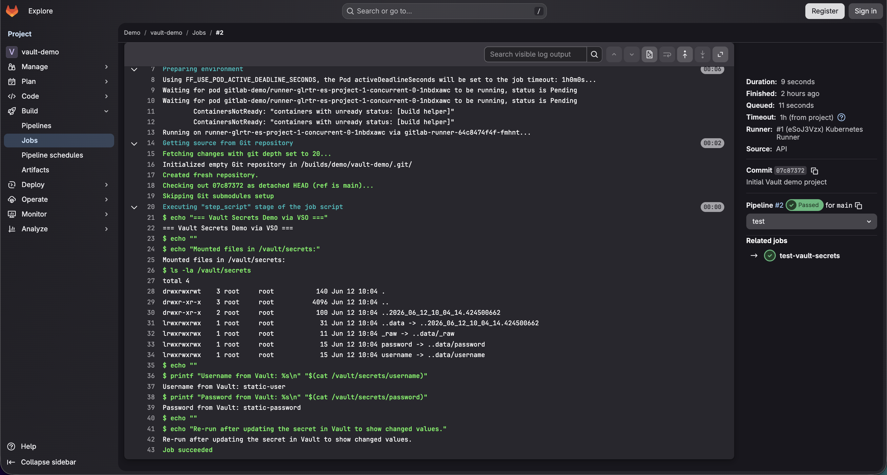
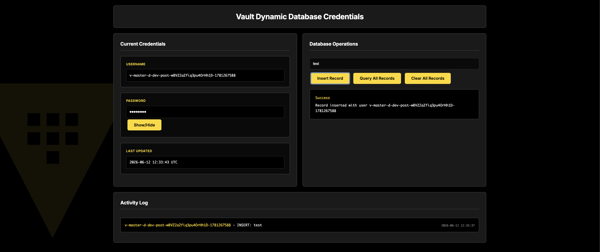
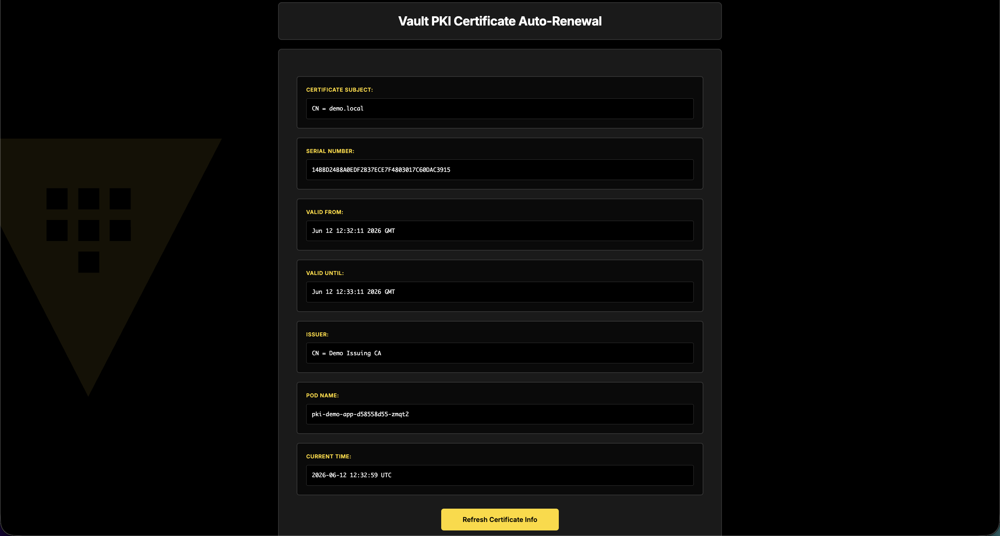
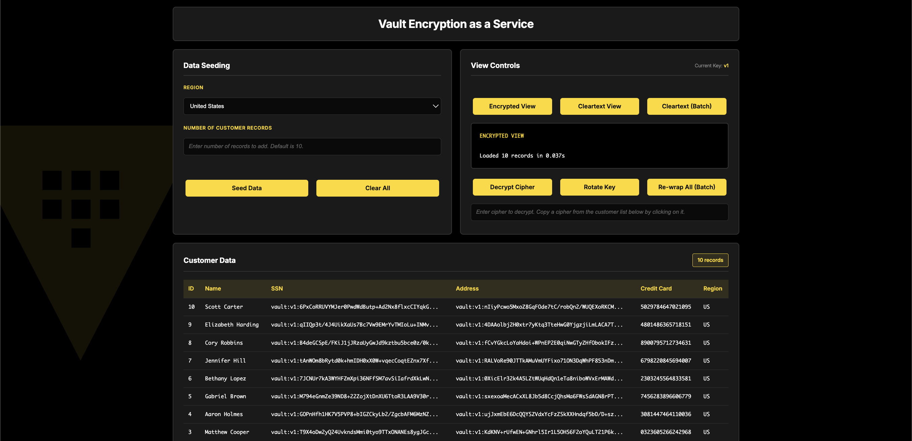
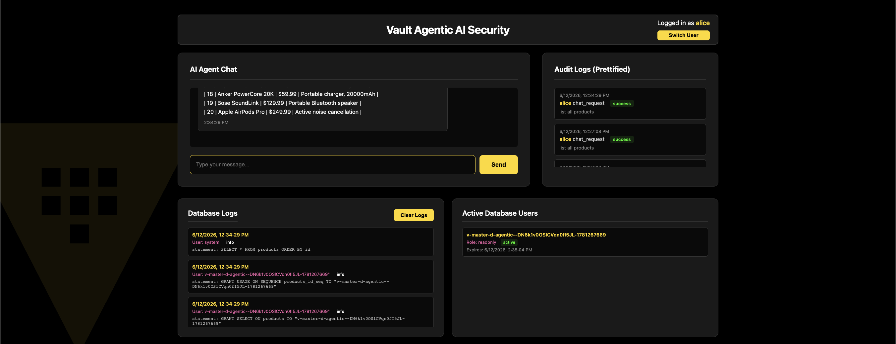
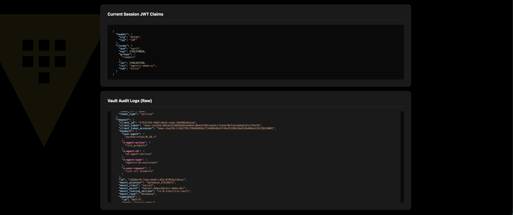
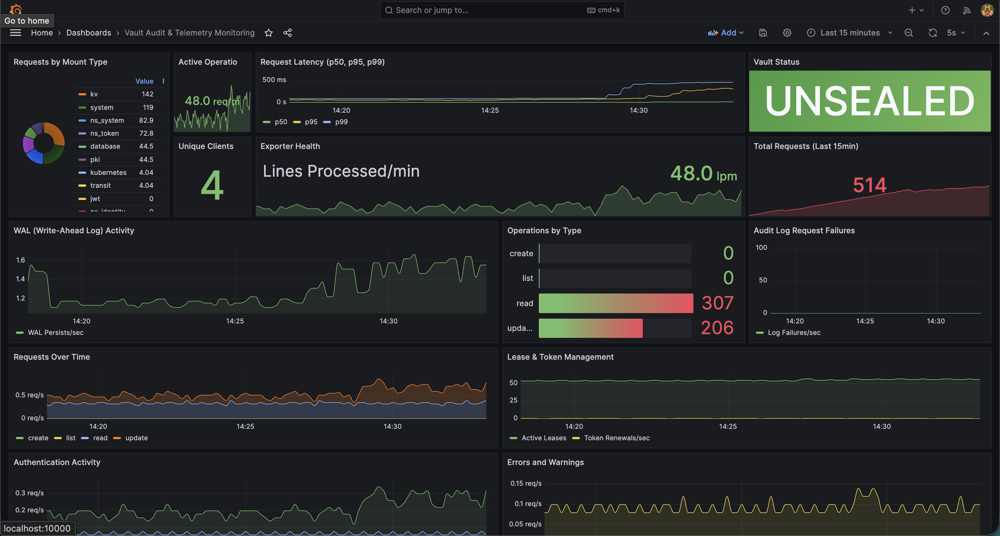

# HashiCorp Vault Enterprise Demo Suite

This repository provides a comprehensive collection of interactive demos showcasing HashiCorp Vault Enterprise capabilities including secrets management, encryption as a service, dynamic credentials, PKI automation, multi-party authorization, agentic AI security, and audit monitoring.

## Table of Contents

- [Overview](#overview)
- [Architecture](#architecture)
- [Prerequisites](#prerequisites)
- [Quick Commands Reference](#quick-commands-reference)
  - [Deploy Everything from Scratch](#deploy-everything-from-scratch)
  - [After Laptop Sleep / System Recovery](#after-laptop-sleep--system-recovery)
  - [Restart After Shutdown](#restart-after-shutdown)
  - [Complete Cleanup](#complete-cleanup)
  - [Redeploy Individual Demos](#redeploy-individual-demos)
- [Complete Setup](#complete-setup)
- [Accessing Vault](#accessing-vault)
- [Demos](#demos)
  - [1. Static Secrets with GitLab CI/CD Demo](#1-static-secrets-with-gitlab-cicd-demo)
  - [2. Dynamic Secrets Demo](#2-dynamic-secrets-demo)
  - [3. PKI Certificate Auto-Renewal Demo](#3-pki-certificate-auto-renewal-demo)
  - [4. Encryption as a Service Demo](#4-encryption-as-a-service-demo)
  - [5. Control Groups Demo](#5-control-groups-demo)
  - [6. Agentic AI Security Demo](#6-agentic-ai-security-demo)
  - [7. Audit Monitoring Demo](#7-audit-monitoring-demo)
- [Technical Details: Authentication and Secret Flows](#technical-details-authentication-and-secret-flows)
- [Vault Resources](#vault-resources-with-master-demo--prefix)
- [Configuration Files](#configuration-files)
- [Makefile Targets](#makefile-targets)
- [Cleanup Options](#cleanup-options)
- [Troubleshooting](#troubleshooting)
- [License](#license)

## Overview

This demo suite showcases real-world Vault Enterprise use cases through interactive web applications and automated workflows. Each demo runs in Kubernetes (Minikube) and connects to a local Vault Enterprise server.

**Key Components:**
- **Local Vault Enterprise** server (127.0.0.1:8200) - persistent, production-like environment
- **Minikube** Kubernetes cluster - hosts all demo applications
- **PostgreSQL** - demonstrates dynamic database credentials
- **Ollama** - provides local LLM inference for AI security demo
- **Prometheus + Grafana** - monitors Vault audit logs and telemetry
- **GitLab CE** (optional) - demonstrates CI/CD pipeline integration

**Featured Demos:**
1. **Static Secrets** - GitLab CI/CD integration with Vault Secrets Operator (VSO)
2. **Dynamic Secrets** - Auto-rotating PostgreSQL credentials with interactive UI
3. **PKI Automation** - Automatic certificate generation and renewal
4. **Encryption as a Service** - Transit encryption and Transform (FPE) engines
5. **Control Groups** - Multi-party authorization workflows
6. **Agentic AI Security** - JWT authentication with group-based identity and dynamic credentials
7. **Audit Monitoring** - Real-time Vault audit log analysis and telemetry dashboards

## Architecture

```
┌─────────────────────────────────────────────────────────────────┐
│   Minikube Cluster                                              │
│                                                                 │
│  ┌──────────────────────────────────────────────────────────┐  │
│  │ Demo Applications                                        │  │
│  │                                                          │  │
│  │ • Static Secrets: GitLab CI/CD (VSO integration)       │  │
│  │ • Dynamic Secrets: Web UI + PostgreSQL (VSO managed)   │  │
│  │ • PKI Secrets: Web app (VSO auto-renewal)              │  │
│  │ • Encryption: Web UI (Transit + Transform engines)     │  │
│  │ • Control Groups: Multi-party authorization UI         │  │
│  │ • Agentic AI: JWT + group-based identity + AI agent    │  │
│  │ • Audit Monitoring: Prometheus + Grafana dashboards    │  │
│  └──────────────┬───────────────────────────────────────────┘  │
│                 │                                               │
│                 │ Kubernetes Auth, Direct API calls, VSO       │
│                 │                                               │
│                                                                 │
│  ┌──────────────────────────────────────────────────────────┐  │
│  │ Agentic AI Demo (agentic-demo namespace)                │  │
│  │                                                          │  │
│  │  Web UI (Flask) ──JWT Token──▶ AI Agent (FastAPI)      │  │
│  │  - User login (Alice/Bob)      - JWT validation        │  │
│  │  - JWT generation              - K8s auth to Vault     │  │
│  │  - JWT claims display          - JWT login to Vault    │  │
│  │  - Chat interface              - Group alias mapping   │  │
│  │  - Audit log display           - Dynamic DB creds      │  │
│  │  - DB monitoring               - Ollama LLM calls      │  │
│  │                                                          │  │
│  │  Ollama (Llama 3.2 1B) ◀────── AI Agent                │  │
│  │  - Local LLM inference         - Natural language      │  │
│  │  - No external APIs            - SQL generation        │  │
│  └──────────────────────────────────────────────────────────┘  │
│                                                                 │
│  ┌──────────────────────────────────────────────────────────┐  │
│  │ Audit Monitoring Stack (audit-monitoring namespace)     │  │
│  │                                                          │  │
│  │  Vault Audit Exporter → Prometheus ← Vault Telemetry   │  │
│  │  - Tails ~/audit.log via hostPath (/host-home)         │  │
│  │  - Parses JSON audit entries                           │  │
│  │  - Exposes Prometheus metrics (10s scrape)             │  │
│  │  - Scrapes Vault /v1/sys/metrics (15s, optional)       │  │
│  │                      ↓                                   │  │
│  │                   Grafana                                │  │
│  │  - Unified dashboard: Vault Audit & Telemetry          │  │
│  │  - 20+ panels combining audit + telemetry metrics      │  │
│  │  - 5s refresh, telemetry panels optional               │  │
│  └──────────────────────────────────────────────────────────┘  │
└─────────────────┼───────────────────────────────────────────────┘
                  │
                  │ HTTPS (via host.minikube.internal)
                  │ Audit logs written to ~/audit.log
                  │
         ┌────────▼────────┐
         │ Local Vault     │
         │ 127.0.0.1:8200  │
         │                 │
         │ Namespace:      │
         │ - master-demo      │
         │                 │
         │ Engines:        │
         │ - master-demo-kv      │
         │ - master-demo-db      │
         │ - master-demo-pki     │
         │ - master-demo-vso-transit-cache (VSO) │
         │ - master-demo-encryption-transit      │
         │ - master-demo-encryption-transform    │
         │                 │
         │ Auth Methods:   │
         │ - master-demo-auth (Kubernetes)       │
         │ - master-demo-jwt (JWT + Identity groups) │
         │                 │
         │ Audit Device:   │
         │ - File audit    │
         │ - ~/audit.log   │
         │ - Auto-rotation │
         │                 │
         │ Telemetry:      │
         │ - /v1/sys/metrics│
         │ - Prometheus fmt│
         │ - 5m retention  │
         │ - Optional      │
         └─────────────────┘
```

### Monitoring Architecture

```
┌─────────────────────────────────────────────────────────┐
│ Local Vault (127.0.0.1:8200)                            │
│                                                          │
│  ~/audit.log          /v1/sys/metrics (optional)        │
│  (JSON logs)          (Prometheus format)               │
└──────┬────────────────────────┬─────────────────────────┘
       │                        │
       │ Tail via hostPath      │ HTTPS + Bearer token
       │                        │
       ▼                        ▼
┌──────────────────┐    ┌──────────────────┐
│ Audit Exporter   │    │ Prometheus       │
│ (Python)         │───▶│ - Scrapes both   │
│ - Parses logs    │    │ - 15d retention  │
│ - Metrics :9091  │    │ - Port: 9090     │
└──────────────────┘    └────────┬─────────┘
                                 │
                                 │ PromQL
                                 ▼
                        ┌──────────────────────────────┐
                        │ Grafana :10000               │
                        │                              │
                        │ Vault Audit & Telemetry      │
                        │ Monitoring Dashboard         │
                        │                              │
                        │ • 20+ unified panels         │
                        │ • Audit metrics (always on)  │
                        │ • Telemetry metrics          │
                        │   (optional, if enabled)     │
                        │ • 5s refresh rate            │
                        └──────────────────────────────┘
```

## Prerequisites

- **make** - Command-line build tool (usually pre-installed on macOS/Linux)
- **Vault Enterprise** running at `127.0.0.1:8200`
- Vault must be **unsealed** and accessible
- **Minikube** installed and running with sufficient resources:
  - **Minimum**: 4GB RAM, 2 CPUs (for basic demos without Agentic AI)
  - **Full Demo**: 16GB RAM, 8 CPUs, 50GB disk (for all demos including Agentic AI)
  - Start with: `minikube start --cpus=8 --memory=16384 --disk-size=50g --driver=docker`
  - Verify resources: `minikube config view` or `make check-agentic-resources`
- **kubectl** and **helm** installed
- **Docker** - Required for building the audit exporter image
- **jq** - JSON processor for cleanup scripts (`brew install jq` on macOS)
- **curl**, **base64**, **openssl** - Standard CLI tools (usually pre-installed)
- **VAULT_TOKEN** environment variable set

### Vault Configuration Requirements

#### Required: Audit Device
Master-demo audit device must be enabled (automatically configured by setup scripts):
```hcl
# Enabled via: vault audit enable -path=master-demo-audit file file_path="$HOME/audit.log"
```

#### Optional: Telemetry (Recommended)
For the telemetry monitoring dashboard, add to your Vault configuration file:
```hcl
telemetry {
  prometheus_retention_time = "5m"
  disable_hostname = false
}
```
**Security Note**: The setup script creates a read-only, long-lived token specifically for Prometheus telemetry scraping:

1. **Policy Created**: A `prometheus` policy is created in the root namespace with read-only access to `sys/metrics`
   ```hcl
   path "sys/metrics" {
     capabilities = ["read"]
   }
   ```

2. **Token Created**: A dedicated token with the `prometheus` policy is created with a 10-year TTL (87600h)

3. **Stored Securely**: The token is stored as a Kubernetes secret named `vault-token` in the `audit-monitoring` namespace and mounted read-only into the Prometheus pod

This approach follows the principle of least privilege - the token can only read telemetry metrics and has no other Vault permissions. The root token is only used during setup to create this limited-scope token.


**Important**:
- For production environments, create a dedicated token with limited permissions (only `sys/metrics` read access)
- The token is stored in plaintext in the Kubernetes secret (base64 encoded)
- Consider using Vault's Kubernetes auth method for more secure token management in production

**Note**: If telemetry is not enabled, the setup will skip telemetry monitoring and deploy audit monitoring only. The setup process is non-blocking and will complete successfully either way.

To verify telemetry is working:
```bash
make check-vault-telemetry
```

### Vault Namespace

All demo resources are created in the `master-demo` Vault namespace for better organization and isolation. This follows Vault Enterprise best practices for multi-tenancy.

## Quick Commands Reference

### Deploy Everything from Scratch
```bash
# Set environment variables
export VAULT_ADDR=https://127.0.0.1:8200
export VAULT_SKIP_VERIFY=true
export VAULT_TOKEN=your-vault-root-token

# Deploy all demos (dynamic, PKI, GitLab CI) est. time 5-10 to deploy
make master-demo
```

### After Laptop Sleep / System Recovery

If demos stop working after your laptop sleeps or after a minikube reboot (VaultAuth resources fail, PKI rotation stops, audit monitoring breaks, etc.), use the enhanced recovery helper:

```bash
make all-recover
```

This script fixes the root cause (stale Kubernetes auth credentials in Vault) and performs a complete recovery:
- **Reconfigures Vault Kubernetes auth** with fresh credentials from the rebooted cluster
- Restarts the minikube mount for audit log access
- Restarts the audit exporter pod
- Restarts the VSO controller
- Restarts all demo deployments (GitLab, Dynamic Secrets, PKI)
- Verifies all VaultAuth resources are working
- Starts all port-forwards automatically

This is especially important after a minikube reboot, as the Kubernetes service account tokens and certificates become invalid, causing VSO authentication to fail.

### Restart After Shutdown
```bash
# 1. Start Vault Enterprise (follow your usual startup process)

# 2. Verify Vault is running and unsealed
vault status

# 3. Start minikube
minikube start

# 4. Set environment variables
export VAULT_ADDR=https://127.0.0.1:8200
export VAULT_SKIP_VERIFY=true
export VAULT_TOKEN=your-vault-root-token

# 5. Recover all services (updates Kubernetes auth, restarts services, starts port-forwards)
make all-recover
```

**What persists automatically:**
- ✅ All Vault data (secrets, policies, roles, PKI CAs)
- ✅ All Kubernetes resources (pods, secrets, deployments)
- ✅ Static secrets (work immediately after restart)
- ✅ PKI certificates (continue auto-renewing)
- ✅ Dynamic secrets (work after port-forward is restarted)

### Complete Cleanup
```bash
# Clean all Vault configuration and demo namespaces (preserves Minikube cluster)
make clean-master-demo

# To completely remove the Minikube cluster (optional):
minikube delete
```

### Redeploy Individual Demos
```bash
# Redeploy static secrets only
make deploy-static-secrets-local

# Redeploy dynamic secrets only
make setup-postgresql-local
make deploy-dynamic-secrets-local

# Redeploy PKI demo only
make setup-pki-vault
make deploy-pki-secrets

# Redeploy encryption as a service demo only
make setup-encryption-vault
make deploy-encryption-secrets

# Redeploy control groups demo only
make setup-controlgroups-vault
make deploy-controlgroups-demo

# Redeploy agentic AI demo only
make agentic-demo-only

# Redeploy audit monitoring only
make setup-audit-monitoring
```


## Complete Setup

### 1. Prerequisites Check

```bash
# Verify Vault is running
vault status

# Verify minikube is available
minikube version

# Verify kubectl and helm
kubectl version --client
helm version
```

### 2. Set Environment Variables

```bash
export VAULT_ADDR=https://127.0.0.1:8200
export VAULT_SKIP_VERIFY=true
export VAULT_TOKEN=your-vault-root-token
```

> **Important:** Do NOT set `VAULT_NAMESPACE` at this stage. The setup scripts will automatically switch to the `master-demo` namespace when needed. Setting `VAULT_NAMESPACE=master-demo` here will cause setup and cleanup scripts to fail, as they need to operate from the root namespace for certain operations (creating/deleting namespaces, enabling audit devices, etc.). The audit device is created at path `master-demo-audit/` to avoid conflicts with any existing audit devices.

### 3. Deploy Everything

```bash
make master-demo
```

This single command will:
1. ✅ Start minikube (if not running)
2. ✅ Configure Vault with auth methods, policies, and secrets engines
3. ✅ Install Vault Secrets Operator
4. ✅ Deploy static secrets demo
5. ✅ Install PostgreSQL
6. ✅ Configure PostgreSQL in Vault with proper permissions
7. ✅ Deploy dynamic secrets **interactive web UI demo**
8. ✅ Configure PKI engines (root + issuing CA)
9. ✅ Deploy PKI certificate auto-renewal demo
10. ✅ Deploy encryption as a service demo
11. ✅ Deploy control groups demo
12. ✅ Deploy agentic AI demo (if resources available)
13. ✅ Setup audit monitoring with Prometheus and Grafana
14. ✅ Start all port-forwards automatically

### 4. Access the Interactive Demos
All port-forwards are automatically started by `make master-demo`. Access the demos at:


- **Vault UI**: https://127.0.0.1:8200 (username: demo / password: demo123)
- **GitLab**: http://localhost:10001 (root / VaultDemoStr0ng!2026)
- **Dynamic DB UI**: http://localhost:10002
- **PKI Demo**: http://localhost:10003
- **Encryption Demo**: http://localhost:10004
- **Control Groups Demo**: http://localhost:10005
- **Agentic AI Demo**: http://localhost:10006 (if resources available)
- **Grafana**: http://localhost:10000 (admin/admin)
- **Prometheus**: http://localhost:9999
- **PostgreSQL**: localhost:9998

**Manage Port-Forwards:**

```bash
# Check status
make status-port-forwards

# Restart all port-forwards (if needed)
make port-forward-all

# Stop all port-forwards
make stop-port-forwards
```

**Individual Port-Forwards (if needed):**

```bash
# Dynamic DB UI - Interactive web interface
make db-ui-port-forward

# PKI Demo - Certificate auto-renewal web interface
make pki-port-forward

# Encryption Demo - Transit encryption and FPE
make encryption-port-forward

# Control Groups Demo - Multi-party authorization
make controlgroups-port-forward

# Agentic AI Demo - AI-powered database queries
make agentic-port-forward

# GitLab - CI/CD integration demo
make gitlab-port-forward

# PostgreSQL (required for dynamic secrets)
make postgres-port-forward

# Grafana - Audit monitoring dashboard
make grafana-port-forward

# Prometheus - Metrics and monitoring
make prometheus-port-forward
```

## Accessing Vault

### For UI Demos (Recommended)

Use the username/password login that's automatically created by `make master-demo`:

1. Navigate to: `https://127.0.0.1:8200/ui/`
2. Select **Username** as the authentication method
3. Enter credentials:
   - **Username**: `demo`
   - **Password**: `demo123`
   - **Mount path**: `userpass` (default, leave as-is)
   - **Namespace**: `master-demo`
4. Click **Sign In**

✅ All secrets in the `master-demo` namespace will be immediately visible.

### For CLI Operations

**Option 1: Using Root Token (Admin Operations)**

Use your root token with the namespace environment variable:

```bash
export VAULT_ADDR=https://127.0.0.1:8200
export VAULT_SKIP_VERIFY=true
export VAULT_TOKEN=your-root-token
export VAULT_NAMESPACE=master-demo

# Now you can run commands
vault kv get master-demo-kv/webapp/config
vault read master-demo-db/creds/dev-postgres
```

**Option 2: Using Username/Password (Demo User)**

Login with the same credentials as the UI:

```bash
export VAULT_ADDR=https://127.0.0.1:8200
export VAULT_SKIP_VERIFY=true
export VAULT_NAMESPACE=master-demo

# Login with username/password
vault login -method=userpass username=demo password=demo123

# Now you can run commands
vault kv get master-demo-kv/webapp/config
vault read master-demo-db/creds/dev-postgres
```

### Summary

- **UI Access**: Use `demo`/`demo123` credentials (created automatically)
- **CLI Access**: Use root token OR login with `demo`/`demo123` via userpass
- **Operator/Pods**: Use Kubernetes auth (configured automatically)

**Note:** The audit monitoring feature requires a Vault audit device at path `master-demo-audit/` writing to `~/audit.log`. The setup script (`make master-demo`) will automatically:
- Enable the master-demo audit device (won't interfere with any existing audit devices)
- Configure automatic log rotation (100MB max, keeps 1 rotated file, 24h rotation)
- No manual configuration needed - Vault Enterprise handles rotation automatically!

Maximum disk usage: ~200MB (current file + 1 rotated backup file).


## Demos

### 1. Static Secrets with GitLab CI/CD Demo

Static secrets are stored in Vault's KV v2 engine (`master-demo-kv`) and automatically synced to Kubernetes. This demo showcases both basic static secret sync and GitLab CI/CD pipeline integration.

#### Option A: Basic Static Secrets (Vault UI)

1. **Access Vault UI** at https://127.0.0.1:8200
   - Login with username: `demo` / password: `demo123`
   - Navigate to: **Secrets** → **master-demo-kv** → **webapp/config**

2. **Modify the secret** in the Vault UI:
   - Click "Create new version"
   - Update `username` or `password` fields
   - Click "Save"

3. **Watch automatic sync to Kubernetes** (~30 seconds):
   ```bash
   # Monitor the Kubernetes secret for changes
   watch -n 2 'kubectl get secret -n static-demo secretkv -o jsonpath="{.data.password}" | base64 -d'
   ```

4. **Observe the change** - The Kubernetes secret updates automatically without pod restarts

#### Option B: GitLab CI/CD Integration

GitLab CE with a lightweight Kubernetes runner demonstrates how CI/CD pipelines can consume secrets from Vault via VSO.



**Access GitLab** at http://localhost:10001
- Username: `root`
- Password: `VaultDemoStr0ng!2026`

**Demo Flow:**
1. Open `http://localhost:10001/demo/vault-demo/-/pipelines`
2. Run the pipeline
3. Inspect job output showing:
   - `/vault/secrets/username`
   - `/vault/secrets/password`
4. Update Vault:
   ```bash
   vault kv put master-demo-kv/webapp/config username="new-user" password="new-pass"
   ```
5. Wait about 30 seconds for VSO sync
6. Re-run the pipeline
7. Show the updated values in the job log

**What this proves:**
- GitLab pipeline does not need direct Vault connectivity
- VSO syncs Vault KV data into a Kubernetes secret
- Runner-created job pods mount the synced secret as files
- Re-running the pipeline after a Vault update shows the changed value

**Configuration:**
- Vault engine: `master-demo-kv` (KV v2)
- Vault path: `webapp/config`
- Vault role: `master-demo-gitlab-role`
- Kubernetes namespace: `gitlab-demo`
- Synced secret: `secretkv`
- Refresh interval: `30s`
- Runner model: separate GitLab Runner deployment using Kubernetes executor
- Secret mount in jobs: `/vault/secrets`

**Useful Commands:**
```bash
# Deploy GitLab demo
make all-gitlab

# Check status
make gitlab-status
make gitlab-logs
make gitlab-runner-logs

# Test Vault connectivity
make test-gitlab-vault

# Cleanup
make clean-gitlab
make clean-gitlab-vault
make clean-gitlab-all
```

**Resource Requirements:**
- Minimum: 4 CPU, 8GB RAM
- Recommended: 6 CPU, 12GB RAM
- GitLab initialization takes several minutes

### 2. Dynamic Secrets Demo

Dynamic secrets are generated on-demand by Vault's database engine (`master-demo-db`) with automatic rotation.

#### Option A: Interactive Web UI Demo (Recommended)

The web UI provides a visual, interactive demonstration of dynamic credentials at **http://localhost:10002**



**Features:**
- 🔄 **Real-time credential display** - Watch username/password update every ~30 seconds
- 💾 **Interactive database operations** - Insert, query, and clear records
- 📊 **Activity log** - See which credentials performed each operation
- 🚫 **No pod restarts** - Credentials update seamlessly via sidecar pattern
- 🎯 **Visual rotation** - Clear indication when credentials change

**How it works:**
1. Credential monitor sidecar reads secrets from Kubernetes API every 3 seconds
2. Web application reads credentials from shared volume (no cache delays)
3. Each database operation shows which credential was used
4. Credentials rotate automatically without disrupting the application

**Web UI Commands:**
```bash
make db-ui-status          # Check deployment status
make db-ui-logs            # View application logs
make clean-db-ui           # Remove web UI (keeps VaultAuth/VaultDynamicSecret)
```

#### Option B: Command-Line Demo

Watch credentials rotate from the command line:

```bash
# Watch credentials rotate every ~20-25 seconds
watch -n 5 'echo "Username:"; kubectl get secret -n db-demo vso-db-demo -o jsonpath="{.data.username}" | base64 -d; echo -e "\nPassword:"; kubectl get secret -n db-demo vso-db-demo -o jsonpath="{.data.password}" | base64 -d'

# View application logs (shows credentials in use)
make db-logs
```

**Configuration:**
- Vault engine: `master-demo-db` (PostgreSQL)
- Vault role: `dev-postgres`
- K8s secret: `vso-db-demo` in namespace `db-demo`
- TTL: 30 seconds (demo-optimized)
- Auto-rotation: ~25 seconds (5s before expiry)
- **No rolloutRestartTargets** - Applications read credentials from file updated by sidecar

To force immediate rotation:
```bash
kubectl delete secret -n db-demo vso-db-demo
# VSO will recreate it immediately with new credentials
```

#### Option C: Database Visualization with pgAdmin

Complement the demo by showing how dynamic roles are actually created and removed in PostgreSQL.

**Use pgAdmin Desktop Application** to connect to the PostgreSQL database.

**Connect to PostgreSQL in pgAdmin:**
1. Open pgAdmin desktop application
2. Right-click **Servers** → **Register** → **Server**
3. **General tab**: Name: `Demo PostgreSQL`
4. **Connection tab**:
   - Host: `localhost`
   - Port: `9998` (via port-forward)
   - Database: `postgres`
   - Username: `postgres`
   - Password: `secret-pass`
5. Click **Save**

**Monitor Dynamic Roles in Real-Time:**
1. Navigate to: **Servers** → **Demo PostgreSQL** → **Login/Group Roles**
2. Right-click **Login/Group Roles** → **Refresh** periodically
3. Watch roles like `v-kubernet-dev-post-<random>` appear and disappear
4. Observe automatic cleanup when credentials expire (~30 seconds)

**Enhanced Demo Flow:**
1. **Web UI** (http://localhost:10002) - Shows current username/password
2. **pgAdmin** - Shows the corresponding PostgreSQL role exists in the database
3. **Wait ~30 seconds** for credential rotation
4. **Web UI** - Displays new credentials
5. **pgAdmin** - Refresh to see old role removed, new role created
6. **Result** - Visual proof that Vault automatically manages database user lifecycle

**What This Demonstrates:**
- ✅ Dynamic credentials are real PostgreSQL users, not just secrets
- ✅ Vault creates users on-demand with proper permissions
- ✅ Expired credentials are automatically revoked from the database
- ✅ No manual cleanup required - Vault handles the entire lifecycle
- ✅ Applications never see expired credentials due to proactive rotation

### 3. PKI Certificate Auto-Renewal Demo

Certificates are automatically generated and renewed by Vault's PKI engine (`master-demo-pki-issuing`).



**Access the demo application** at http://localhost:10003

**Useful commands:**
```bash
# Watch certificate expiration in real-time
make watch-pki-certs

# Check PKI demo status
make pki-status

# View application logs
make pki-logs
```

**Configuration:**
- Vault engines: `master-demo-pki-root` (Root CA), `master-demo-pki-issuing` (Issuing CA)
- Vault role: `master-demo-cert-issuer`
- K8s secret: `pki-demo-tls` in namespace `pki-demo`
- Certificate TTL: 30 seconds (demo-optimized)
- Auto-renewal: ~25 seconds (5s before expiry)
- Root CA validity: 10 years
- Issuing CA validity: 1 year

**What you'll see:**
- Certificates automatically renew every ~25 seconds
- No pod restarts required
- Web UI shows current certificate details
- Serial number changes with each renewal

**PKI-specific commands:**
```bash
# Deploy PKI demo only
make all-pki

# Clean up PKI demo
make clean-pki

# Clean up PKI Vault configuration
make clean-pki-vault

# Complete PKI cleanup (K8s + Vault)
make clean-pki-all
```
### 4. Encryption as a Service Demo

Demonstrates Vault's **Transit** (encryption) and **Transform** (tokenization with FPE) engines for protecting sensitive data at rest. This interactive demo shows how to encrypt customer data, tokenize credit cards, manage encryption keys, and decrypt individual ciphertexts.



**What This Demo Shows:**
- **Transit Engine**: Encryption/decryption of sensitive fields (SSN, address)
- **Transform Engine**: Format-preserving encryption (FPE) for credit cards
- **Key Rotation**: Rotate encryption keys without re-encrypting data
- **Re-wrapping**: Update encrypted data to use the latest key version
- **Batch Operations**: Efficient bulk encryption/decryption
- **Multi-Region Support**: Generate US or Swedish fake customer data
- **Interactive Decryption**: Click any cipher cell to decrypt individual values

**Access the demo application** at http://localhost:10004

**Demo Features:**

1. **Data Seeding**
   - Select region: United States or Sweden
   - Choose number of rows (1-1000, default 10)
   - Real-time progress modal with stop button
   - Clear all data

2. **View Modes**
   - **Encrypted View**: Shows ciphertext for all fields
   - **Cleartext View**: Decrypts each record on-demand
   - **Cleartext (Batch)**: Uses batch API for faster decryption
   - Displays elapsed time for each operation

3. **Key Management & Decryption**
   - **Decrypt Cipher**: Click any cipher cell to copy and decrypt it
   - **Rotate Key**: Increment the Transit key version
   - **Re-wrap All**: Update all encrypted data to latest key version
   - View current key version in the header

**Architecture:**

```
┌─────────────────────────────────────────────────────────┐
│ Encryption Demo UI (Flask + HTTP Polling)              │
│ - Real-time data seeding with progress modal           │
│ - Three view modes (encrypted/cleartext/batch)         │
│ - Key rotation and re-wrapping                         │
│ - Interactive cipher decryption                        │
└────────────┬────────────────────────────────────────────┘
             │
             ├──────────────────────────────────────────┐
             │                                          │
             ▼                                          ▼
┌────────────────────────┐              ┌──────────────────────────┐
│ Vault Transit Engine   │              │ Vault Transform Engine   │
│ master-demo-encryption-│              │ master-demo-encryption-  │
│ transit                │              │ transform                │
│                        │              │                          │
│ - Encrypts SSN         │              │ - Tokenizes credit cards │
│ - Encrypts address     │              │ - FPE (16-digit format)  │
│ - Decrypts ciphers     │              │ - Preserves card format  │
│ - Supports batch ops   │              │                          │
│ - Key rotation         │              │                          │
│ - Re-wrapping          │              │                          │
└────────────────────────┘              └──────────────────────────┘
             │                                          │
             └──────────────┬───────────────────────────┘
                            │
                            ▼
              ┌─────────────────────────┐
              │ PostgreSQL              │
              │ encryption_demo DB      │
              │                         │
              │ customers table:        │
              │ - name (plaintext)      │
              │ - ssn (encrypted)       │
              │ - address (encrypted)   │
              │ - credit_card (tokenized)│
              │ - region (plaintext)    │
              │ - key_version           │
              └─────────────────────────┘
```

**Data Examples:**

*US Customer Data:*
- Name: John Smith
- SSN: 123-45-6789 (encrypted with Transit)
- Address: 123 Main St, New York, NY 10001 (encrypted with Transit)
- Credit Card: 4532123456789012 (tokenized with Transform FPE)

*Swedish Customer Data:*
- Name: Anna Andersson
- Personnummer: 19850315-1234 (encrypted with Transit)
- Address: Storgatan 1, 111 22 Stockholm (encrypted with Transit)
- Credit Card: 4532123456789012 (tokenized with Transform FPE)

**Demo Flow:**

1. **Seed Data**
   ```
   - Select region (US or Swedish)
   - Enter row count (default 10)
   - Click "Seed Data"
   - Watch real-time progress modal with current customer name
   - Stop seeding mid-operation if needed
   - Each row is encrypted/tokenized before storage
   ```

2. **View Encrypted Data**
   ```
   - Click "Encrypted View"
   - See ciphertext: vault:v1:abc123...
   - See tokenized cards: 4532987654321098
   - Note: Cards maintain 16-digit format (FPE)
   - Click any cipher cell to copy and decrypt it
   ```

3. **Decrypt Individual Ciphers**
   ```
   - Click any cipher cell in the table
   - Cipher is copied to clipboard and decrypt input field
   - Click "Decrypt Cipher" button
   - See decrypted plaintext value with timing
   ```

4. **View Cleartext Data**
   ```
   - Click "Cleartext View" (single decryption)
   - Or "Cleartext (Batch)" (faster bulk decryption)
   - See original plaintext values
   - Compare elapsed times between modes
   ```

5. **Rotate Encryption Key**
   ```
   - Click "Rotate Key"
   - Key version increments (v1 → v2)
   - Existing data still uses old version
   - New data uses new version
   - Current key version shown in header
   ```

6. **Re-wrap Data**
   ```
   - Click "Re-wrap All (Batch)"
   - All encrypted data updated to latest key version
   - No decryption/re-encryption needed
   - Vault handles re-wrapping internally
   ```

**Technical Details:**

**Transit Engine:**
- Path: `master-demo-encryption-transit`
- Key: `customer-key`
- Algorithm: AES256-GCM96
- Supports: encrypt, decrypt, rewrap, rotate
- Batch operations for performance

**Transform Engine:**
- Path: `master-demo-encryption-transform`
- Transformation: `credit-card-fpe`
- Type: Format-Preserving Encryption (FPE)
- Template: 16-digit credit card format
- Preserves: Length and format (looks like a valid card)

**Why FPE for Credit Cards?**
- Maintains data format (16 digits)
- Compatible with existing systems
- Passes validation checks
- Reduces application changes

**Key Rotation vs Re-wrapping:**
- **Rotation**: Creates new key version, doesn't touch data
- **Re-wrapping**: Updates data to use latest key version
- Re-wrapping is cryptographically efficient (no decrypt/encrypt)

**Makefile Targets:**

```bash
# Setup and deploy
make setup-encryption-vault    # Configure Vault engines
make deploy-encryption-demo    # Deploy to Kubernetes

# Access and monitor
make encryption-port-forward   # Access UI (http://localhost:10004)
make encryption-logs          # View application logs
make encryption-status        # Check deployment status

# Cleanup
make clean-encryption         # Remove Kubernetes resources
```

**Vault Configuration:**

The setup script creates:
- Transit engine with `customer-key`
- Transform engine with FPE transformation
- PostgreSQL database `encryption_demo`
- Policy `master-demo-encryption-policy`
- Kubernetes auth role `master-demo-auth-role-encryption`

**Performance Comparison:**

| Operation | Single | Batch | Improvement |
|-----------|--------|-------|-------------|
| Decrypt 50 records | ~2.5s | ~0.5s | 5x faster |
| Rewrap 50 records | ~2.5s | ~0.5s | 5x faster |

*Batch operations significantly improve performance for bulk data operations.*

**Security Benefits:**

1. **Data Protection**: Sensitive data encrypted at rest
2. **Key Management**: Centralized key rotation and versioning
3. **Compliance**: Meet regulatory requirements (PCI-DSS, GDPR)
4. **Audit Trail**: All encryption operations logged
5. **Format Preservation**: FPE maintains data usability

**Use Cases:**

- **Healthcare**: Encrypt patient SSN, medical records
- **Finance**: Tokenize credit cards, encrypt account numbers
- **E-commerce**: Protect customer PII
- **SaaS**: Multi-tenant data encryption

### 5. Control Groups Demo

**Vault Enterprise Feature**: Multi-party authorization for sensitive secrets

This demo showcases Vault's Control Groups feature, which requires multiple authorized users to approve access to sensitive secrets before they can be retrieved. It implements a "two-person rule" or "four-eyes principle" for secret access.


**Architecture:**
```
┌─────────────────────────────────────────────────────────────────┐
│ Control Groups Demo UI (Flask)                                  │
│                                                                  │
│ ┌─────────────────────────────────────────────────────────────┐ │
│ │ Interactive Flow Diagram        │  Real-time Audit Log      │ │
│ │ Request → Control Group →       │  [--:--:--] Event         │ │
│ │ Approve → Unwrap                │  [--:--:--] Event         │ │
│ └─────────────────────────────────────────────────────────────┘ │
│                                                                  │
│ ┌──────────────────────┬──────────────────────────────────────┐ │
│ │ User Panel           │ Admin Panel (Role Switcher)          │ │
│ │ - Request secrets    │ - Ops Team / Security Team           │ │
│ │ - View status        │ - Approve/Deny requests              │ │
│ │ - Unwrap approved    │ - View pending approvals             │ │
│ │ - Clear requests     │                                      │ │
│ └──────────────────────┴──────────────────────────────────────┘ │
└─────────────────────────────────────────────────────────────────┘
                          │
                          ▼
┌─────────────────────────────────────────────────────────────────┐
│ Vault Control Groups                                            │
│ - Non-critical secrets: 1/2 approval (ops OR security)         │
│ - Critical secrets: 2/2 approvals (ops AND security)           │
│ - Wrapped responses with authorization workflow                │
└─────────────────────────────────────────────────────────────────┘
```

**Features:**
- **Interactive Flow Diagram**: Visual 4-step workflow with real-time highlighting
  - Step 1: Request (user requests secret)
  - Step 2: Control Group (authorizers assigned)
  - Step 3: Approve (required approvals)
  - Step 4: Unwrap (access granted)
- **Real-time Audit Log**: Live event tracking showing all Control Groups activities
- **User Panel**: Request access to secrets, view request status, unwrap approved secrets, clear all requests
- **Admin Panel**: Role switcher (Ops/Security), approve or deny pending requests
- **Two Approval Tiers**:
  - `dev/*` secrets: Require 1 of 2 approvals (ops OR security)
  - `prod/*` secrets: Require 2 of 2 approvals (ops AND security)
- **Visual Status Indicators**: Pending (⏳), Approved (✓), Denied (✗)

**Demo Secrets:**
- `secret/data/dev/api-key` - Development API key (1/2 approval)
- `secret/data/dev/database` - Development database credentials (1/2 approval)
- `secret/data/prod/db-password` - Production database password (2/2 approvals)
- `secret/data/prod/encryption-key` - Production encryption key (2/2 approvals)

**Workflow:**
1. **User requests secret**: Select a secret path and click "Request Access"
2. **Request created**: User sees pending request with approval status
3. **Admin approves**: Switch to Ops or Security role and approve the request
4. **Additional approval** (for prod secrets): Switch to the other role and approve again
5. **User unwraps**: Once approved, click "Unwrap Secret" to retrieve the actual secret

**Access:**
```bash
# Port-forward the UI
make controlgroups-port-forward

# Access at http://localhost:10005
```

**Setup (included in master-demo):**
```bash
# Setup Vault configuration
make setup-controlgroups-vault

# Deploy the demo
make deploy-controlgroups-demo
```

**Manual Testing:**
```bash
# View logs
make controlgroups-logs

# Check status
make controlgroups-status

# Clean up
make clean-controlgroups
```

**Vault Configuration:**
- **Policies**: `master-demo-controlgroups-user`, `master-demo-controlgroups-ops`, `master-demo-controlgroups-security`
- **Identity Groups**: `ops-team`, `security-team`
- **Kubernetes Auth Roles**: Separate roles for user, ops, and security personas
- **Control Group Factors**: Configured per secret path with different approval requirements

**Use Cases:**
- Production secret access requiring multiple approvals
- Compliance requirements (SOX, PCI-DSS, HIPAA)
- Break-glass scenarios with audit trail
- Separation of duties enforcement
- High-value asset protection

- **Compliance**: GDPR, HIPAA, PCI-DSS requirements


### 6. Agentic AI Security Demo

**Advanced Demo**: Secure AI agent workflows with proper authentication, authorization, and auditing using HashiCorp Vault, JWT-based identity, and local LLM.



This demo showcases how to build secure AI agent systems that:
- Use JWT tokens for user authentication and authorization
- Implement entity-based authorization with dynamic policy attachment
- Inherit user permissions for database access via Vault entities
- Provide full audit trails with user and agent context
- Run locally with intelligent resource management

**⚠️ Resource Requirements:**
- **Minimum**: 6GB available RAM, 3 CPU cores
- **Recommended**: 8GB available RAM, 4 CPU cores
- The system automatically checks resources before deployment
- If insufficient, provides clear guidance on resource allocation

**Architecture:**
```
┌─────────────────────────────────────────────────────────────────┐
│ Web UI (Flask)                                                   │
│ - User login (Alice: read-only, Bob: admin)                    │
│ - Generates JWT tokens with user identity and groups           │
│ - Chat interface for natural language queries                   │
│ - Live Vault audit log display (filtered for agentic demo)     │
│ - Database activity monitoring (logs + active users)            │
│ - Authenticates to Vault via Kubernetes auth                   │
└────────────────────┬────────────────────────────────────────────┘
                     │ JWT Token (signed with RSA key from Vault)
                     ▼
┌─────────────────────────────────────────────────────────────────┐
│ AI Agent Service (FastAPI)                                      │
│ - Validates user JWT token (RS256 signature)                   │
│ - Authenticates to Vault using Kubernetes ServiceAccount       │
│ - Creates Vault entity alias for user (if not exists)          │
│ - Attaches user group policies to entity dynamically           │
│ - Retrieves user-scoped database credentials from Vault        │
│ - Calls Ollama LLM for natural language processing            │
│ - Executes database operations with proper authorization       │
│ - Adds user context to Vault audit logs via headers           │
└────────────────────┬────────────────────────────────────────────┘
                     │
        ┌────────────┼────────────┐
        │            │            │
        ▼            ▼            ▼
┌──────────┐  ┌──────────┐  ┌──────────┐
│ Vault    │  │ Vault    │  │ Ollama   │
│ K8s Auth │  │ JWT Auth │  │ LLM      │
│          │  │ + Entity │  │ (Llama   │
│ Agent    │  │ Aliases  │  │ 3.2 1B)  │
│ Auth     │  │          │  │          │
│          │  │ Dynamic  │  │ Local    │
│          │  │ DB Creds │  │ Model    │
└──────────┘  └──────────┘  └──────────┘
```

**Key Features:**

1. **JWT-Based User Authentication**
   - UI generates signed JWT tokens with user identity and groups
   - RSA key pair stored in Vault KV (private key for signing)
   - Agent validates JWT signature using public key from Vault
   - Token includes: username, groups (readonly/admin), expiration



2. **Vault Entity-Based Authorization**
   - Dynamic entity alias creation for each user
   - Group-based policy attachment (alice → readonly, bob → admin)
   - Policies attached to entities, not tokens
   - Enables user-scoped database credential retrieval

3. **User-Scoped Permissions**
   - **Alice** (readonly group): Can query products, cannot modify
   - **Bob** (admin group): Full access to create, update, delete
   - Agent retrieves credentials based on user's entity policies
   - Database credentials scoped to user authorization level

4. **Complete Audit Trail**
   - Every operation logged with:
     - User ID (alice/bob)
     - Agent context (via custom headers)
     - Request context
     - Database operation performed
   - Real-time audit log display in UI (filtered for agentic demo)

5. **Local LLM Integration**
   - Ollama with Llama 3.2 1B model
   - Natural language to SQL translation
   - Runs entirely locally (no external API calls)
   - Automatic model download on first deployment

**Demo Flow:**

1. **Login as Alice** (read-only user)
   - Ask: "Show me all products"
   - ✅ Query succeeds with read-only credentials
   - Try: "Add a new product"
   - ❌ Operation denied (insufficient permissions)

2. **Login as Bob** (admin user)
   - Ask: "Add a new product: Laptop, $999"
   - ✅ Insert succeeds with admin credentials
   - Ask: "Update product price"
   - ✅ Update succeeds

3. **Observe Audit Logs**
   - See user ID in every operation
   - See agent context in custom headers
   - See database credentials used
   - Full compliance trail
   - Database activity monitoring (logs + active users)

**Access:**
```bash
# Check if your system has sufficient resources
make check-agentic-resources

# Deploy the demo (automatically checks resources)
make agentic-demo

# Or deploy standalone (minimal resources)
make agentic-demo-only

# Access the UI
make agentic-port-forward
# Open http://localhost:10006
```

**Deployment Modes:**

1. **Full Deployment** (`make master-demo`)
   - Deploys all demos including Agentic AI if resources available
   - Automatically checks resources before deployment
   - Skips Agentic AI with clear message if insufficient resources

2. **Standalone Mode** (`make agentic-demo-only`)
   - Deploys only Agentic AI demo components
   - Minimal resource footprint
   - Ideal for dedicated testing

3. **Add-on Mode** (`make agentic-demo`)
   - Adds Agentic AI to existing deployment
   - Checks resources first
   - Provides guidance if resources insufficient

**Monitoring:**
```bash
# Check deployment status
make agentic-status

# View UI logs
make agentic-ui-logs

# View agent logs
make agentic-logs

# View Ollama logs
make ollama-logs

# Check resource usage
kubectl top pods -n agentic-demo
```

**Cleanup:**
```bash
# Remove Agentic AI demo
make clean-agentic

# Cleanup is also included in
make clean-master-demo
```

**Technical Components:**

- **Ollama**: Local LLM service with Llama 3.2 1B model
- **AI Agent**: FastAPI service handling JWT validation, Vault auth, and LLM
- **Web UI**: Flask application with user login, JWT generation, and chat interface
- **PostgreSQL**: Database with products table for demo queries
- **Vault**: Entity-based authorization with JWT and Kubernetes auth

**Vault Configuration:**
- **Auth Methods**:
  - `master-demo-auth` (Kubernetes auth for agent and UI)
  - `master-demo-jwt` (JWT auth for user identity)
- **Policies**:
  - `master-demo-agentic-base` - Base agent permissions
  - `master-demo-agentic-alice` - Read-only database access (attached to alice entity)
  - `master-demo-agentic-bob` - Full database access (attached to bob entity)
  - `master-demo-policy-agentic-ui` - UI permissions (JWT key access)
- **Database Roles**:
  - `agentic-readonly-role` - Read-only credentials for Alice
  - `agentic-admin-role` - Full access credentials for Bob
- **Entities**: Dynamic entity aliases created for each user with group-based policies
- **Audit**: All operations logged with user context via custom headers

**Use Cases:**
- Secure AI agent systems with proper authorization
- Compliance requirements for AI operations
- Multi-user AI applications with role-based access
- Audit trails for AI-driven database operations
- Entity-based authorization for dynamic policy attachment

**Security Benefits:**
1. **JWT-Based Identity**: Signed tokens with user identity and groups
2. **Entity-Based Authorization**: Dynamic policy attachment based on user groups
3. **Least Privilege**: Users get only necessary permissions via entity policies
4. **Complete Audit Trail**: Every operation tracked with user context
5. **User Context Propagation**: Agent actions tied to users via entities
6. **Dynamic Credentials**: Database passwords rotate automatically

### 7. Audit Monitoring Demo

Real-time monitoring and visualization of Vault operations through Prometheus and Grafana, with two complementary dashboards:
- **Audit Dashboard** - Security and compliance monitoring from audit logs
- **Telemetry Dashboard** - Performance and health metrics (optional, requires telemetry enabled)



**Access the dashboards:**
- **Grafana**: http://localhost:10000 (admin/admin)
- **Prometheus**: http://localhost:9999

**Generate test traffic:**
```bash
make test-audit-traffic
```

**Check telemetry availability:**
```bash
make check-vault-telemetry
```

#### Components

**1. Vault Audit Exporter (Python)**
- Tails the Vault audit log file (`~/audit.log`)
- Parses JSON audit entries (both request and response)
- Calculates latency from request/response pairs
- Exposes 9 Prometheus metric families
- Handles log rotation gracefully
- Resource usage: ~50-100MB memory, <5% CPU

**2. Vault Telemetry Scraper (Optional)**
- Scrapes `/v1/sys/metrics` endpoint directly from Vault
- Requires telemetry enabled in Vault config
- Provides native Vault performance metrics
- Scrapes every 15 seconds
- Uses VAULT_TOKEN for authentication

**3. Prometheus**
- Scrapes audit exporter every 10 seconds (near real-time)
- Scrapes Vault telemetry every 15 seconds (if enabled)
- 15-day retention
- Port: 9090
- Resource usage: ~512MB memory, ~200m CPU

**4. Grafana**
- Two pre-configured dashboards
- Audit: 15 panels, 5-second refresh
- Telemetry: 15 panels, 10-second refresh (if enabled)
- Port: 10000
- Default credentials: admin/admin
- Resource usage: ~256MB memory, ~100m CPU

#### Available Dashboards

##### 1. Vault Audit Monitoring (Always Available)
Security and compliance monitoring from audit logs - 15 panels:

1. **Total Requests** - Last 15 minutes
2. **Error Rate** - With warning/critical thresholds
3. **Active Operations** - Requests per minute
4. **Unique Clients** - Distinct client IPs
5. **Requests Over Time** - Stacked area chart
6. **Requests by Mount Type** - Pie chart (KV, DB, PKI, etc.)
7. **Operations by Type** - Bar gauge (read, write, delete, list)
8. **Top 10 Paths** - Most accessed Vault paths
9. **Authentication Activity** - Login attempts and methods
10. **Errors and Warnings** - Error tracking over time
11. **KV Operations** - Static secret access patterns
12. **Database Credentials** - Dynamic secret generation
13. **PKI Certificates** - Certificate issuance and renewal
14. **Request Latency** - p50, p95, p99 percentiles
15. **Exporter Health** - Monitoring system status

##### 2. Vault Telemetry & Performance (Optional - Requires Telemetry Enabled)
Native Vault performance and health metrics - 15 panels:

1. **Total API Requests** - Cumulative request count
2. **Average Request Latency** - p99 latency with thresholds
3. **Vault Seal Status** - Unsealed/sealed indicator
4. **Leader Elections** - Cluster stability tracking
5. **Request Rate Over Time** - Operations per second
6. **Request Latency (p50, p99)** - Performance distribution
7. **Token Operations** - Token creates and lookups
8. **Policy Evaluations** - Access control activity
9. **Secrets Engine Operations (KV)** - KV read/write rates
10. **Database Operations** - DB connection lifecycle
11. **Audit Log Requests** - Audit system health
12. **Audit Log Failures** - Compliance monitoring
13. **Unsealed Status Timeline** - Historical seal status
14. **Audit Activity Over Time** - Audit throughput
15. **Core Metrics Summary** - Key metrics table

**Key Metrics Tracked:**
- Core health (request rate, latency, leader elections)
- Seal/unseal status
- Authentication activity by method
- Policy evaluations
- Secrets engine usage (reads/writes/errors)
- Audit log metrics
- Performance replication (Enterprise)

#### Metrics Exposed

**Audit Metrics (from exporter):**
- `vault_audit_requests_total` - Request counts by operation, path, mount type
- `vault_audit_responses_total` - Response status codes
- `vault_audit_auth_requests_total` - Authentication activity
- `vault_audit_mount_requests_total` - Per-mount activity
- `vault_audit_errors_total` - Error tracking
- `vault_audit_warnings_total` - Warning tracking
- `vault_audit_request_duration_seconds` - Latency histogram
- `vault_audit_lease_operations_total` - Lease operations
- `vault_audit_pki_operations_total` - PKI-specific operations

**Telemetry Metrics (from Vault, if enabled):**
- `vault_core_handle_request_count` - Total API requests
- `vault_core_handle_request` - Request latency (quantiles)
- `vault_core_unsealed` - Seal status (1=unsealed, 0=sealed)
- `vault_core_leadership_setup_failed` - Leader election failures
- `vault_token_create_count` - Token creation rate
- `vault_token_lookup_count` - Token lookup rate
- `vault_policy_get_policy` - Policy evaluation rate
- `vault_secret_kv_count` - KV operations
- `vault_database_*` - Database operations
- `vault_audit_log_request` - Audit log entries
- `vault_audit_log_request_failure` - Audit failures

#### Configuration

**Audit Log:**
- Location: `~/audit.log`
- Mounted in minikube at `/host-home` via hostPath
- Automatic rotation: 100MB files, keeps 1 rotated file (~200MB max)
- Rotation handled by Vault Enterprise (no cron needed)

**Scraping:**
- Interval: 10 seconds (near real-time)
- Dashboard refresh: 5 seconds
- Prometheus retention: 15 days

**Access URLs:**
- Grafana: http://localhost:10000 (admin/admin)
- Prometheus: http://localhost:9999
- Exporter metrics: http://localhost:9999/metrics

#### What You'll See

- 📊 **Real-time request activity** - Every Vault operation visualized instantly
- 🔐 **Authentication patterns** - Track which services access Vault and when
- 📈 **Secret engine activity** - KV reads, database credential generation, PKI issuance
- ⚠️ **Error rates and warnings** - Immediate visibility into issues
- ⏱️ **Request latency** - Performance metrics (p50, p95, p99 percentiles)
- 🎯 **Top paths** - Most frequently accessed Vault paths
- 📉 **Operations breakdown** - Read, write, delete, list operations
- 🔄 **Dynamic secrets rotation** - Watch credentials being generated and revoked
- 🔒 **PKI certificate lifecycle** - Certificate issuance and renewal patterns

#### Useful Commands

```bash
# View current metrics directly
make audit-exporter-metrics

# Generate test traffic for demo
make test-audit-traffic

# Check all component status
make audit-monitoring-status

# View exporter logs
make audit-exporter-logs

# Clean up (removes all monitoring components)
make clean-audit-monitoring
```

#### Troubleshooting

**Audit log not rotating (file grows beyond 100MB):**

Vault's built-in file rotation doesn't work reliably on macOS. The log file can grow to hundreds of MB even though rotation is configured.

**Solution: Set up automatic rotation**
```bash
# Set up automatic rotation via cron (checks every 6 hours)
make setup-auto-audit-rotation
```

This creates a cron job that:
- Checks log size every 6 hours
- Rotates when file exceeds 100MB
- Keeps only 1 rotated file (compressed)
- Works without requiring Vault tokens
- Logs activity to `/tmp/vault-audit-rotation.log`

**How it works:**
1. Copies `audit.log` to `audit.log.1`
2. Truncates `audit.log` (Vault continues writing)
3. Compresses `audit.log.1` to save space
4. Restarts audit exporter to reset metrics

**Manual rotation:**
```bash
# Check current log size
make check-audit-log-size

# Force rotation immediately (requires VAULT_TOKEN)
make force-audit-rotation
```

**View rotation logs:**
```bash
tail -f /tmp/vault-audit-rotation.log
```

**Dashboard shows old data after clearing audit log:**
```bash
# Restart exporter to reset metrics
kubectl rollout restart deployment/vault-audit-exporter -n audit-monitoring
```

Note: Prometheus counters are monotonic (only increase). Clearing the log file doesn't reset displayed metrics. Restarting the exporter resets its internal counters. For a complete reset including Prometheus data, use `make clean-audit-monitoring && make setup-audit-monitoring`.

**Exporter not starting:**
```bash
# Check logs
make audit-exporter-logs

# Verify audit log exists
ls -la ~/audit.log

# Verify Vault audit device is enabled
vault audit list
```

**No metrics in Prometheus:**
```bash
# Check if Prometheus can reach exporter
kubectl port-forward -n audit-monitoring svc/vault-audit-exporter 9999:9091 &
curl http://localhost:9999/metrics

# Check Prometheus targets
make prometheus-port-forward
# Open: http://localhost:9999/targets
```

**Dashboard shows no data:**
```bash
# Verify Prometheus has data
make prometheus-port-forward
# Open: http://localhost:9999/graph
# Query: vault_audit_requests_total

# Check Grafana datasource configuration
# Grafana → Configuration → Data Sources → Prometheus
# Should point to: http://prometheus:9090

**Telemetry dashboard not appearing:**
```bash
# Check if telemetry was enabled during setup
make check-vault-telemetry

# If telemetry is now enabled, redeploy monitoring
make clean-audit-monitoring
make setup-audit-monitoring

# Verify Prometheus is scraping Vault
make prometheus-port-forward
# Open: http://localhost:9090/targets
# Look for "vault-telemetry" job
```

**Telemetry metrics showing "No Data":**
```bash
# Verify Vault telemetry endpoint is accessible with demo user
export VAULT_NAMESPACE=master-demo
DEMO_TOKEN=$(vault login -method=userpass username=demo password=demo123 -token-only)
curl -H "X-Vault-Token: $DEMO_TOKEN" \
  https://127.0.0.1:8200/v1/sys/metrics?format=prometheus | head -20

# Check if vault-token secret exists
kubectl get secret vault-token -n audit-monitoring

# If missing or expired, recreate it (setup script will create a new 1-year token)
make clean-audit-monitoring
make setup-audit-monitoring

# Or manually create a new token:
DEMO_TOKEN=$(vault login -method=userpass username=demo password=demo123 -token-only)
NEW_TOKEN=$(VAULT_TOKEN=$DEMO_TOKEN vault token create \
  -policy=master-demo-admin \
  -ttl=8760h \
  -renewable=true \
  -display-name="prometheus-telemetry" \
  -format=json | jq -r '.auth.client_token')

kubectl create secret generic vault-token \
  --from-literal=token="$NEW_TOKEN" \
  -n audit-monitoring \
  --dry-run=client -o yaml | kubectl apply -f -

# Restart Prometheus to pick up the new secret
kubectl rollout restart deployment/prometheus -n audit-monitoring
```

**Token expired (after 1 year):**
The setup script creates a 1-year renewable token. To renew or recreate:
```bash
# Option 1: Redeploy monitoring (creates new token)
make clean-audit-monitoring && make setup-audit-monitoring

# Option 2: Manual renewal (if token is still renewable)
kubectl get secret vault-token -n audit-monitoring -o jsonpath='{.data.token}' | base64 -d | \
  xargs -I {} vault token renew {}
```

**To enable telemetry after initial setup:**
1. Add telemetry stanza to your Vault config:
   ```hcl
   telemetry {
     prometheus_retention_time = "5m"
     disable_hostname = false
   }
   ```
2. Restart Vault
3. Redeploy monitoring: `make clean-audit-monitoring && make setup-audit-monitoring`
```

#### Performance and Scalability

The exporter processes logs line-by-line with minimal memory footprint and can handle:
- ~1000 requests/second
- Log files up to several GB
- Rotation without data loss
- Continuous operation for extended periods

#### Security Considerations

1. **Audit Log Access**: Exporter has read-only access via hostPath mount
2. **Sensitive Data**: Vault HMAC-hashes sensitive fields in audit logs
3. **Network**: All services run within Kubernetes cluster namespace
4. **Credentials**: Change default Grafana password (admin/admin) in production

#### Files and Structure

```
audit-monitoring/
├── exporter/
│   ├── vault_audit_exporter.py       # Main exporter code
│   ├── requirements.txt               # Python dependencies
│   └── Dockerfile                     # Container image
├── kubernetes/
│   ├── 00-namespace.yaml             # audit-monitoring namespace
│   ├── 01-exporter-deployment.yaml   # Exporter deployment and service
│   ├── 02-prometheus-config.yaml     # Prometheus configuration
│   ├── 03-prometheus-deployment.yaml # Prometheus deployment and service
│   ├── 04-grafana-config.yaml        # Grafana datasources and dashboard
│   └── 05-grafana-deployment.yaml    # Grafana deployment and service
├── grafana/
│   └── vault-audit-dashboard.json    # Dashboard definition (15 panels)
└── logrotate-vault-audit.conf        # Alternative log rotation config
```


## Technical Details: Authentication and Secret Flows

### Connection to Local Vault

VSO connects to your local Vault using `host.minikube.internal`, which resolves to your host machine's IP from within minikube pods. This allows the Kubernetes cluster to access your local Vault server without complex networking.

### Kubernetes Authentication

1. Service accounts in Kubernetes have associated service account tokens (JWTs)
2. VSO uses the Kubernetes auth method to authenticate with Vault
3. Vault validates the service account tokens with the Kubernetes API (via `master-demo-auth` mount)
4. Upon successful validation, Vault issues Vault tokens with appropriate policies

### Static Secrets Flow

1. Secrets stored in Vault's KV v2 engine (`master-demo-kv/webapp/config`)
2. `VaultStaticSecret` CRD tells VSO what to sync
3. VSO authenticates using `VaultAuth` CRD
4. VSO reads secret from Vault and creates K8s secret `secretkv` in `static-demo` namespace
5. Automatically refreshed every 30 seconds
6. Changes in Vault propagate to Kubernetes

### Dynamic Secrets Flow

1. `VaultDynamicSecret` CRD requests credentials from `master-demo-db`
2. VSO authenticates and requests credentials from Vault
3. Vault generates new PostgreSQL user with 30s TTL
4. VSO creates K8s secret `vso-db-demo` in `db-demo` namespace with credentials
5. Before expiry (~25s), VSO requests new credentials
6. Old credentials automatically revoked by Vault

### PKI Certificate Flow

1. `VaultPKISecret` CRD requests certificate from `master-demo-pki-issuing`
2. VSO authenticates and requests certificate from Vault
3. Vault generates certificate signed by Issuing CA (30s TTL)
4. VSO creates K8s secret with certificate, private key, and CA chain
5. Before expiry (~25s), VSO requests new certificate
6. Old certificate automatically revoked by Vault
7. **No pod restart needed** - applications read updated secret

### Transit Encryption

VSO uses Vault's Transit engine (`master-demo-transit`) to encrypt its client cache:
- Cache encryption key `vso-client-cache` stored in Vault
- Adds security layer for cached secrets
- Even if Kubernetes is compromised, cache is encrypted

## Vault Resources (with master-demo- prefix)

All Vault resources use the `master-demo-` prefix for easy identification:

### Auth Methods
- `master-demo-auth` - Kubernetes authentication mount

### Secrets Engines
- `master-demo-kv` - KV v2 for static secrets
- `master-demo-db` - PostgreSQL database for dynamic credentials
- `master-demo-pki-root` - Root CA (10-year validity)
- `master-demo-pki-issuing` - Issuing CA (1-year validity)
- `master-demo-transit` - Transit encryption for VSO cache

### Policies
- `master-demo-webapp` - Read access to static secrets
- `master-demo-auth-policy-db` - Read access to dynamic credentials
- `master-demo-pki-issuer` - Issue/sign/revoke certificates
- `master-demo-auth-policy-operator` - VSO operator transit encryption

### Roles
- `master-demo-role1` - Static secrets role
- `master-demo-auth-role` - Dynamic secrets role
- `master-demo-pki-cert-issuer` - PKI certificate issuance role
- `master-demo-auth-role-operator` - VSO operator role

## Configuration Files

### Vault Setup Scripts
- [`scripts/setup/setup-local-vault.sh`](scripts/setup/setup-local-vault.sh) - Configures Vault auth, KV, database, and transit engines
- [`scripts/setup/setup-postgresql-vault.sh`](scripts/setup/setup-postgresql-vault.sh) - Configures the PostgreSQL database secrets engine
- [`scripts/setup/setup-pki-vault.sh`](scripts/setup/setup-pki-vault.sh) - Configures PKI root and issuing CAs
- [`scripts/setup/setup-gitlab-demo.sh`](scripts/setup/setup-gitlab-demo.sh) - End-to-end GitLab demo setup: Vault policy/role, GitLab deployment, VSO resources, project bootstrap, and runner registration
- [`scripts/setup/vault-operator-values.yaml`](scripts/setup/vault-operator-values.yaml) - Helm values for VSO installation

### Cleanup Script
- [`scripts/cleanup/cleanup-all.sh`](scripts/cleanup/cleanup-all.sh) - Removes all demo-related Vault configuration and deletes the Minikube cluster

### VSO Configuration
- VSO install values are stored in [`scripts/setup/vault-operator-values.yaml`](scripts/setup/vault-operator-values.yaml)

### Static Secrets
- [`static-secrets/vault-auth-static.yaml`](static-secrets/vault-auth-static.yaml) - VaultAuth CRD
- [`static-secrets/static-secret.yaml`](static-secrets/static-secret.yaml) - VaultStaticSecret CRD

### Dynamic Secrets
- [`dynamic-secrets/vault-auth-dynamic.yaml`](dynamic-secrets/vault-auth-dynamic.yaml) - VaultAuth CRD
- [`dynamic-secrets/vault-dynamic-secret.yaml`](dynamic-secrets/vault-dynamic-secret.yaml) - VaultDynamicSecret CRD
- [`dynamic-secrets/app-deployment.yaml`](dynamic-secrets/app-deployment.yaml) - Simple CLI application
- [`dynamic-secrets/app-deployment-ui.yaml`](dynamic-secrets/app-deployment-ui.yaml) - Interactive web UI with credential monitor
- [`dynamic-secrets/service.yaml`](dynamic-secrets/service.yaml) - Service for web UI access
- [`dynamic-secrets/app-deployment.yaml`](dynamic-secrets/app-deployment.yaml) - Sample application

### PKI Secrets
- [`pki-secrets/vault-auth-pki.yaml`](pki-secrets/vault-auth-pki.yaml) - VaultAuth CRD
- [`pki-secrets/vault-pki-secret.yaml`](pki-secrets/vault-pki-secret.yaml) - VaultPKISecret CRD
- [`pki-secrets/app-deployment.yaml`](pki-secrets/app-deployment.yaml) - Nginx with cert monitor
- [`pki-secrets/service.yaml`](pki-secrets/service.yaml) - Service for HTTPS/HTTP access

### GitLab CI Demo
- [`static-secrets-gitlab-ci/manifests/gitlab-simple.yaml`](static-secrets-gitlab-ci/manifests/gitlab-simple.yaml) - Lightweight GitLab CE + runner manifest
- [`static-secrets-gitlab-ci/vault-auth-gitlab.yaml`](static-secrets-gitlab-ci/vault-auth-gitlab.yaml) - VaultAuth for GitLab demo
- [`static-secrets-gitlab-ci/gitlab-static-secret.yaml`](static-secrets-gitlab-ci/gitlab-static-secret.yaml) - VaultStaticSecret syncing `secretkv`
- [`static-secrets-gitlab-ci/sample-project/.gitlab-ci.yml`](static-secrets-gitlab-ci/sample-project/.gitlab-ci.yml) - Pipeline that prints the Vault-synced secret
- [`static-secrets-gitlab-ci/sample-project/README.md`](static-secrets-gitlab-ci/sample-project/README.md) - Sample project documentation
- [`scripts/setup/setup-gitlab-demo.sh`](scripts/setup/setup-gitlab-demo.sh) - Complete GitLab demo setup and project bootstrap

## Makefile Targets

### Complete Setup
```bash
make master-demo            # Deploy everything (dynamic + PKI + GitLab CI demo)
make all-pki                # Deploy PKI demo only
make all-gitlab             # Deploy GitLab CI demo only
```

### Individual Components
```bash
make start-minikube         # Start minikube cluster
make setup-local-vault      # Configure Vault (auth, KV, DB, transit)
make install-vso-local      # Install Vault Secrets Operator
make install-postgresql-pod # Install PostgreSQL
make setup-postgresql-local # Configure PostgreSQL in Vault
make deploy-db-ui           # Deploy dynamic secrets web UI demo
make setup-pki-vault        # Configure PKI engines in Vault
make deploy-pki-secrets     # Deploy PKI demo application
make setup-gitlab-demo      # Complete GitLab CI demo setup
make agentic-demo-only      # Deploy Agentic AI demo only
```

### Port-Forwarding
```bash
make port-forward-all       # Start ALL port-forwards in background (recommended!)
make stop-port-forwards     # Stop all port-forwards
make status-port-forwards   # Check which port-forwards are running
make db-ui-port-forward     # Access DB UI demo only (http://localhost:10002)
make pki-port-forward       # Access PKI demo only (http://localhost:10003)
make encryption-port-forward # Access Encryption demo only (http://localhost:10004)
make controlgroups-port-forward # Access Control Groups demo only (http://localhost:10005)
make agentic-port-forward   # Access Agentic AI demo only (http://localhost:10006)
make postgres-port-forward  # Port-forward PostgreSQL only (localhost:9998)
make gitlab-port-forward    # Port-forward GitLab UI (http://localhost:10001)
make grafana-port-forward   # Access Grafana dashboard (http://localhost:10000)
make prometheus-port-forward # Access Prometheus (http://localhost:9999)
```

### Monitoring & Testing
```bash
make test-local             # Test all demos
make pki-status             # Check PKI demo status
make watch-pki-certs        # Watch certificate renewal
make pki-logs               # View PKI demo logs
make all-recover            # Restart VSO, audit monitoring, and verify PKI rotation after sleep/staleness
make db-logs                # View dynamic DB demo logs (CLI version)
make db-ui-status           # Check dynamic DB UI demo status
make db-ui-logs             # View dynamic DB UI demo logs
make agentic-status         # Check Agentic AI demo status
make agentic-logs           # View Agentic AI demo logs
make vso-logs               # View VSO operator logs
# GitLab validation is done by re-running the demo pipeline after updating Vault
```

### Cleanup
```bash
make clean-master-demo      # Remove all demo Vault config and delete the Minikube cluster
```

## Cleanup Options

### Complete Cleanup (Remove Everything)
```bash
# Remove all demo Vault configuration and delete demo namespaces
make clean-master-demo
```

> **Note:** The cleanup script deletes the `vault-secrets-operator-system` namespace, which can take several minutes to terminate due to finalizers. If you don't need to preserve the Minikube cluster for other purposes, you can speed up cleanup by:
> 1. Ctrl+C to terminate the cleanup script after Vault resources are removed
> 2. Run `minikube delete` to completely remove the cluster (much faster)

### Manual Cleanup
```bash
# Delete the Minikube cluster
minikube delete

# Vault configuration (all demos)
vault delete auth/master-demo-auth/role/master-demo-gitlab-role
vault delete auth/master-demo-auth/role/master-demo-role1
vault delete auth/master-demo-auth/role/master-demo-auth-role
vault delete auth/master-demo-auth/role/master-demo-auth-role-operator
vault delete auth/master-demo-auth/role/master-demo-pki-cert-issuer
vault policy delete master-demo-gitlab-policy
vault policy delete master-demo-webapp
vault policy delete master-demo-auth-policy-db
vault policy delete master-demo-pki-issuer
vault policy delete master-demo-auth-policy-operator
vault secrets disable master-demo-kv
vault secrets disable master-demo-db
vault secrets disable master-demo-pki-root
vault secrets disable master-demo-pki-issuing
vault secrets disable master-demo-transit
vault auth disable master-demo-auth
```

## Troubleshooting

### VSO Cannot Connect to Vault

```bash
# Verify Vault is accessible from host
curl -k https://127.0.0.1:8200/v1/sys/health

# Check from minikube
minikube ssh "curl -k https://host.minikube.internal:8200/v1/sys/health"

# Check VSO logs
make vso-logs
```

### Secrets Not Syncing

```bash
# Check VSO logs
kubectl logs -n vault-secrets-operator-system -l app.kubernetes.io/name=vault-secrets-operator -f

# Check VaultAuth status
kubectl get vaultauth -A

# Check all VSO CRDs
kubectl get vaultstaticsecret -A
kubectl get vaultdynamicsecret -A
kubectl get vaultpkisecret -A

# Describe specific resource for details
kubectl describe vaultstaticsecret vault-kv-app -n static-demo
```

### Dynamic Secrets Not Working

```bash
# Verify port-forward is running
ps aux | grep "port-forward.*postgres"

# Restart port-forward using make command
make postgres-port-forward &

# Or manually
kubectl port-forward -n postgres svc/postgres-postgresql 9998:5432 &

# Test Vault can connect to PostgreSQL
vault read master-demo-db/creds/dev-postgres

# Check if database engine is configured
vault read master-demo-db/config/master-demo-db
```

### PKI Certificates Not Renewing

```bash
# Check PKI demo status
make pki-status

# Check VaultPKISecret status
kubectl describe vaultpkisecret pki-demo-cert -n pki-demo

# Verify PKI engines are configured
vault read master-demo-pki-issuing/roles/master-demo-cert-issuer

# Test certificate issuance manually
vault write master-demo-pki-issuing/issue/master-demo-cert-issuer common_name="test.local" ttl="30s"

# Check application logs
make pki-logs
```

### Minikube IP Changed After Restart

After a minikube restart, the Kubernetes API endpoint and certificates change, causing Vault's Kubernetes auth to fail. Use the automated recovery:

```bash
make all-recover
```

This reconfigures Vault's Kubernetes auth with the fresh cluster credentials and restarts all necessary components.

### VaultAuth Resources Not Ready After Reboot

**Symptoms:**
- `kubectl get vaultauth -A` shows `READY: False` for one or more resources
- VSO logs show authentication errors like "permission denied" or "invalid token"
- Demos stop working after minikube reboot

**Root Cause:**
After a minikube reboot, the Kubernetes service account tokens and CA certificates that Vault uses for authentication become invalid. This breaks the Kubernetes auth method in Vault, preventing VSO from authenticating.

**Solution:**
Run the automated recovery script:

```bash
make all-recover
```

**What the script does:**
1. Extracts fresh Kubernetes API endpoint and CA certificate
2. Generates a new service account token
3. Reconfigures Vault's Kubernetes auth with the fresh credentials
4. Restarts VSO controller to pick up the changes
5. Restarts all demo deployments
6. Verifies all VaultAuth resources are working
7. Starts port-forwards

**Manual Recovery (if script fails):**

```bash
# 1. Set environment variables
export VAULT_ADDR=https://127.0.0.1:8200
export VAULT_TOKEN=your-token
export VAULT_NAMESPACE=master-demo

# 2. Get fresh Kubernetes configuration
KUBE_HOST=$(kubectl config view --raw --minify --flatten -o jsonpath='{.clusters[0].cluster.server}')
KUBE_CA_CERT=$(kubectl config view --raw --minify --flatten -o jsonpath='{.clusters[0].cluster.certificate-authority-data}' | base64 -d)

# 3. Generate new service account token
TOKEN_REVIEWER_JWT=$(kubectl create token vault-auth-reviewer -n vault-secrets-operator-system --duration=87600h)

# 4. Reconfigure Vault Kubernetes auth
vault write auth/master-demo-auth/config \
    kubernetes_host="$KUBE_HOST" \
    kubernetes_ca_cert="$KUBE_CA_CERT" \
    token_reviewer_jwt="$TOKEN_REVIEWER_JWT"

# 5. Restart VSO controller
kubectl rollout restart deployment/vault-secrets-operator-controller-manager -n vault-secrets-operator-system

# 6. Wait and verify
sleep 15
kubectl get vaultauth -A
```

**Verification:**
All VaultAuth resources should show `READY: True`:

```bash
kubectl get vaultauth -A
```

Expected output:
```
NAMESPACE     NAME           READY   VALID
gitlab-demo   gitlab-auth    True    True
db-demo       dynamic-auth   True    True
pki-demo      pki-auth       True    True
```

## License

See [LICENSE](LICENSE) file for details.
